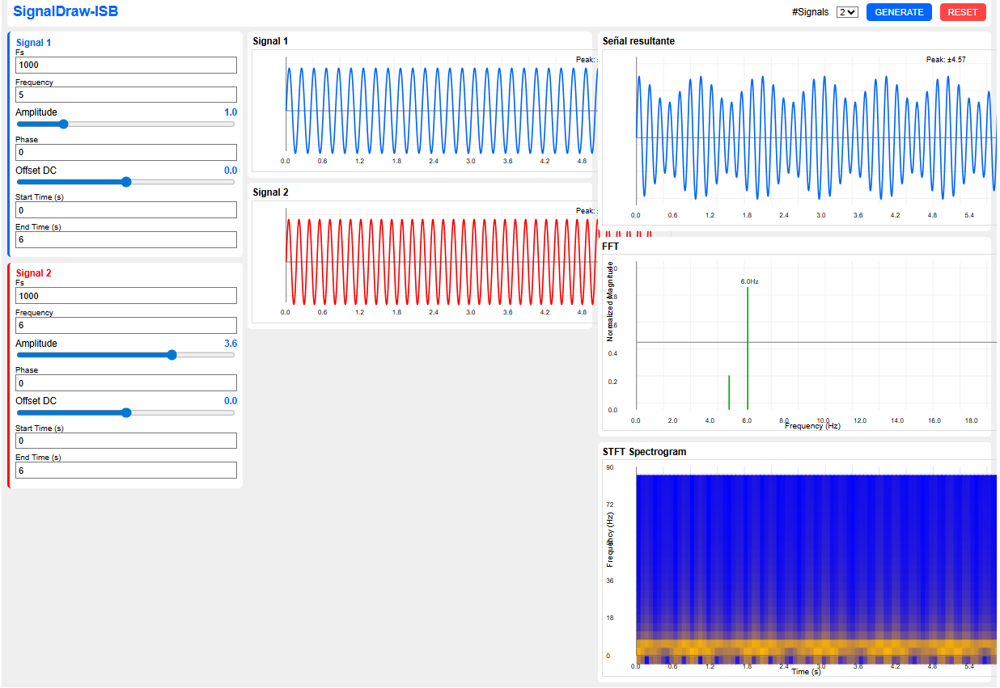

# SignalDraw ISB

Generador de señales senoidales en notebook de Python.




## Installation

```bash
$ pip install git+https://github.com/MSMRo/signalDraw-isb.git

#pip install signaldraw-isb  # Proximamente
```

## Usage

```python
from signaldraw_isb import SignalDraw

ui = SignalDraw()
ui
```

Then you can access the signals generated:
```python
# Retorna una lista con todas las señales usadas
# signals[0] es la señal resultante de la suma
# signals[1:] son los senos trabajados
ui.signals

# fs retorna una lista de todas las frecuencias usadas
# fs[0] es 0 si se usan diferentes fs en cada señal, si no es la misma usada en todas.
# fs[1:] son las frecuencias de muestreo de cada señal senoidal
ui.fs

# Retorna un numpy array con el result signal
ui.signal_numpy 

# Retorna una lista de numpy arrays de todos los signals individuales 
ui.signals_numpy 
```

